# React Native商城应用模板快速入门

## 目录

- [功能介绍](#功能介绍)
- [约束与限制](#约束与限制)
- [快速入门](#快速入门)
- [示例效果](#示例效果)
- [开源许可协议](#开源许可协议)

## 功能介绍

本模板为商城类应用提供了常用功能的开发样例，模板主要分首页、分类、购物车和我的四大模块：

* 首页：提供热搜词轮播搜索框、商品轮播图、商品金刚位、推荐商品列表以及商品排序筛选等功能。
* 分类：提供商品快速筛选类别的二级分类列表功能。
* 购物车：支持查看购物车商品、管理购物车商品（增减、删除、支持侧滑删除）、商品选择和结算、商品推荐列表等功能。
* 我的：提供个人信息查看和修改、我的订单、我的积分、优惠券、我的消息、浏览记录、我的收藏、地址管理、设置、意见反馈和联系客服等功能。

本模板已集成华为账号一键登录、系统分享、碰一碰分享等服务，适配双折叠一多布局，只需做少量配置和定制即可快速实现商城购物等功能。

| 首页                                           | 分类                                               | 购物车                                          | 我的                                             |
|----------------------------------------------|--------------------------------------------------|----------------------------------------------|------------------------------------------------|
| 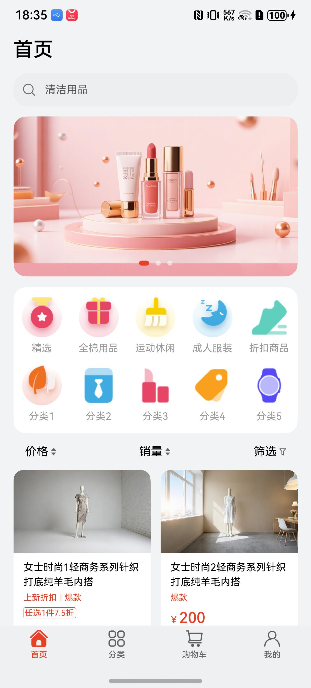 | 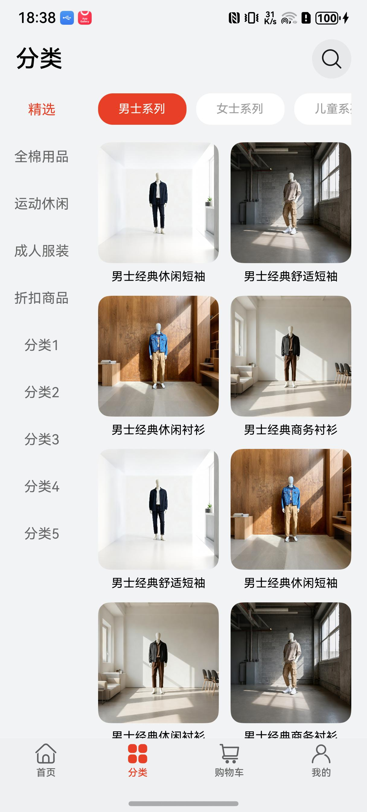 | 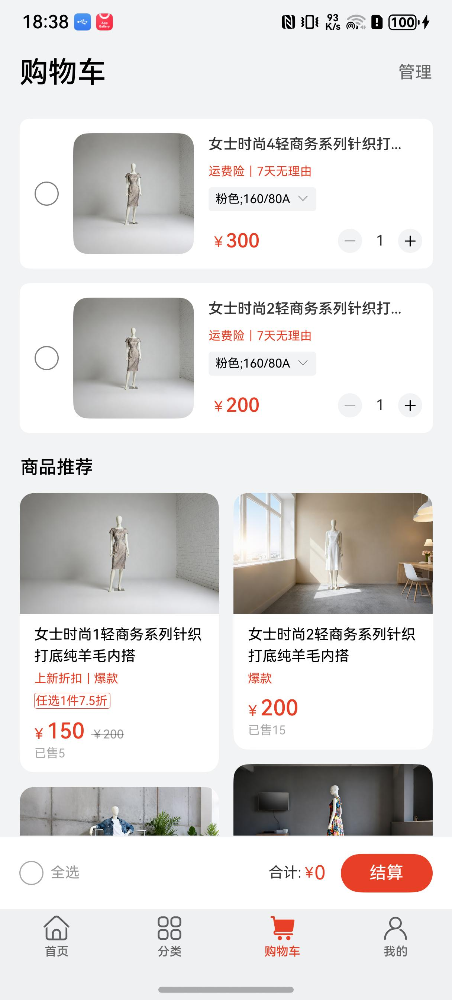 | 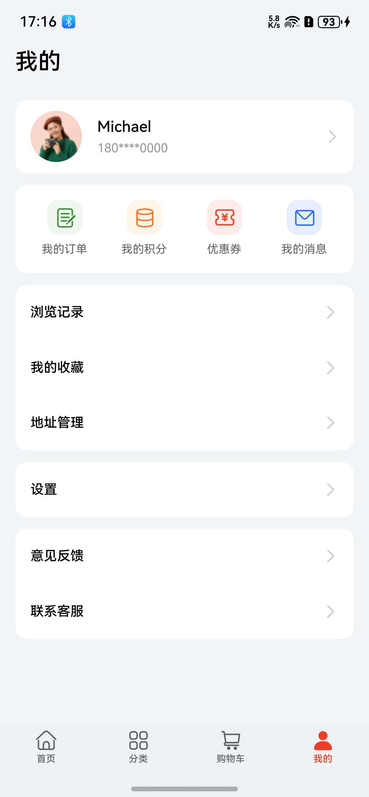 |

本模板主要页面及核心功能如下所示：

```text
商城（RN）应用模板
  ├──首页                           
  │   ├──顶部栏-搜索  
  │   │   ├── 历史搜索                          
  │   │   └── 热门搜索                      
  │   │         
  │   ├──轮播图         
  │   │                    
  │   ├──分类选择
  │   │   └── 分类列表                         
  │   │
  │   ├──商品列表    
  │   │   ├── 动态布局                                             
  │   │   └── 排序和筛选     
  │   │                    
  │   └──商品详情    
  │       ├── 图片、视频轮播图    
  │       ├── 商品详情                                         
  │       ├── 评价    
  │       ├── 联系客服           
  │       │    └── 文本消息、图片、订单发送
  │       │         
  │       ├── 加入购物车、立即购买
  │       └── 收藏、分享
  │
  ├──分类                           
  │   ├──顶部栏                          
  │   │   └── 搜索                      
  │   │         
  │   ├──侧边栏         
  │   │   └── 品类选择  
  │   │     
  │   ├──品类列表  
  │   │   ├── 二级品类Tab                                             
  │   │   └── 动态布局  
  │   │                                      
  │   └──商品详情   
  │       ├── 图片、视频轮播图    
  │       ├── 商品详情                                         
  │       ├── 评价    
  │       ├── 联系客服       
  │       │    └── 文本消息、图片、订单发送
  │       │       
  │       ├── 加入购物车、立即购买
  │       └── 收藏、分享                          
  │                        
  ├──购物车                           
  │   ├──顶部栏                      
  │   │   └── 购物车管理                      
  │   │         
  │   ├──加入购物车商品列表         
  │   │   ├── 动态布局                                             
  │   │   └── 信息流   
  │   │  
  │   ├──加入购物车商品详情   
  │   │    ├── 图片、视频轮播图    
  │   │    ├── 商品详情                                         
  │   │    ├── 评价    
  │   │    ├── 联系客服           
  │   │    │     └── 文本消息、图片、订单发送
  │   │    │       
  │   │    ├── 加入购物车、立即购买
  │   │    └── 收藏、分享                           
  │   │                    
  │   ├──商品推荐列表    
  │   │     └── 信息流
  │   │  
  │   ├──推荐商品详情   
  │   │    ├── 图片、视频轮播图    
  │   │    ├── 商品详情                                         
  │   │    ├── 评价    
  │   │    ├── 联系客服        
  │   │    │     └── 文本消息、图片、订单发送
  │   │    │                 
  │   │    ├── 加入购物车、立即购买
  │   │    └── 收藏、分享                     
  │   │
  │   └──购物车结算 
  │        ├── 确定订单
  │        └── 华为支付  
  │ 
  │ 
  └──我的                           
      ├──登录  
      │   └── 华为账号一键登录                        
      │         
      ├──个人信息         
      │   └── 头像、昵称详情和修改
      │                    
      ├──导航栏    
      │   ├── 我的订单
      │   │    ├── 全部、待付款、代发货、待收货、待评价、退款/售后
      │   │    ├── 订单详情
      │   │    │    ├── 取消订单
      │   │    │    ├── 立即支付
      │   │    │    ├── 删除订单
      │   │    │    ├── 再来一单
      │   │    │    ├── 申请退款
      │   │    │    │    └── 退款原因选择
      │   │    │    │
      │   │    │    ├── 催发货
      │   │    │    ├── 联系客服
      │   │    │    │    └── 文本消息、图片、订单发送
      │   │    │    │
      │   │    │    ├── 取消退款
      │   │    │    ├── 确认收货
      │   │    │    └── 评价
      │   │    │         └── 星级评价、文字评价、图片上传      
      │   │    ├── 取消订单
      │   │    ├── 立即支付
      │   │    ├── 删除订单
      │   │    ├── 再来一单
      │   │    ├── 申请退款
      │   │    │     └── 退款原因选择
      │   │    ├── 催发货
      │   │    ├── 联系客服
      │   │    │     └── 文本消息、图片、订单发送
      │   │    │
      │   │    ├── 取消退款
      │   │    ├── 确认收货
      │   │    └── 评价
      │   │          └── 星级评价、文字评价、图片上传
      │   │                                        
      │   ├── 我的积分 
      │   │    ├── 积分余额
      │   │    ├── 积分明细
      │   │    ├── 积分签到
      │   │    └── 积分兑换
      │   │    
      │   ├── 优惠券    
      │   │    ├── 全部、可用、已用、已过期
      │   │    └── 平台优惠券、店铺优惠券、无门槛优惠券、折扣券、满减卷
      │   │        
      │   └── 我的消息
      │        ├── 官方旗舰店消息
      │        ├── 系统通知消息
      │        ├── 客服助手消息
      │        └── 活动推送消息
      │
      └──常用服务    
          ├── 浏览历史   
          │      └── 历史管理                                     
          ├── 我的收藏
          ├── 地址管理
          │   ├── 地址列表
          │   ├── 默认地址、编辑、删除
          │   ├── 新增地址
          │   └── 从华为账号导入地址
          │
          ├── 意见反馈   
          ├── 联系客服                
          └── 设置
               ├── 账号安全             
               ├── 隐私设置                       
               ├── 清除缓存           
               ├── 检测版本 
               ├── 关于 
               ├── 隐私政策 
               ├── 用户协议 
               └── 退出登录                               
```

本模板工程代码结构如下所示：

```text
rnmall
├──src                                                     // React Native源代码目录
│  ├──bundles                                              // 打包模块
│  │   └──basic                                            // 基础bundle
│  │       └──basic.tsx                                    // 基础bundle入口
│  │
│  └──ts                                                   // TypeScript源码
│      ├──modules                                          // 业务模块
│      │   └──base                                         // 基础业务模块
│      │       ├──pages                                    // 页面目录
│      │       │   ├──address                              // 地址管理
│      │       │   │   ├──http                             // 地址相关接口
│      │       │   │   ├──model                            // 地址数据模型
│      │       │   │   └──AddressChangeDialog.tsx         // 地址修改弹窗
│      │       │   │
│      │       │   ├──cart                                 // 购物车模块
│      │       │   │   ├──api                              // 购物车接口
│      │       │   │   ├──viewmodel                        // 购物车视图模型
│      │       │   │   ├──CartItem.tsx                     // 购物车商品项
│      │       │   │   ├──CartPage.tsx                     // 购物车页面
│      │       │   │   ├──CartPayDetail.tsx                // 购物车结算详情
│      │       │   │   └──SelectAllBtn.tsx                 // 全选按钮
│      │       │   │
│      │       │   ├──category                             // 分类模块
│      │       │   │   ├──repositry                        // 分类数据仓库
│      │       │   │   ├──viewmodel                        // 分类视图模型
│      │       │   │   ├──CategoryListPage.tsx             // 分类列表页
│      │       │   │   └──CategoryPage.tsx                 // 分类主页
│      │       │   │
│      │       │   ├──collection                           // 收藏模块
│      │       │   │   ├──viewmodel                        // 收藏视图模型
│      │       │   │   ├──CollectionItem.tsx               // 收藏商品项
│      │       │   │   └──CollectionPage.tsx               // 收藏页面
│      │       │   │
│      │       │   ├──command                              // 评价模块
│      │       │   │   ├──viewmodel                        // 评价视图模型
│      │       │   │   ├──CommandItem.tsx                  // 评价项
│      │       │   │   └──ProductCommandPage.tsx           // 商品评价页
│      │       │   │
│      │       │   ├──coupons                              // 优惠券模块
│      │       │   │   ├──mockData                         // 模拟数据
│      │       │   │   ├──model                            // 优惠券数据模型
│      │       │   │   ├──viewmodel                        // 优惠券视图模型
│      │       │   │   ├──CouponsPage.tsx                  // 优惠券页面
│      │       │   │   └──CouponsSelectDialog.tsx          // 优惠券选择弹窗
│      │       │   │
│      │       │   ├──detail                               // 商品详情模块
│      │       │   │   ├──data                             // 详情数据
│      │       │   │   ├──productSelector                  // 商品选择器
│      │       │   │   ├──viewmodel                        // 详情视图模型
│      │       │   │   ├──DetailPage.tsx                   // 商品详情页
│      │       │   │   └──ShareView.tsx                    // 分享视图
│      │       │   │
│      │       │   ├──evaluate                             // 评价模块
│      │       │   │   ├──model                            // 评价数据模型
│      │       │   │   ├──toeval                           // 待评价
│      │       │   │   ├──viewmodel                        // 评价视图模型
│      │       │   │   ├──EvaluationItem.tsx               // 评价项
│      │       │   │   ├──ProductAllEvalPage.tsx           // 全部评价页
│      │       │   │   └──ProductEvalCard.tsx              // 评价卡片
│      │       │   │
│      │       │   ├──home                                 // 首页模块
│      │       │   │   ├──model                            // 首页数据模型
│      │       │   │   ├──repository                       // 首页数据仓库
│      │       │   │   ├──viewmodel                        // 首页视图模型
│      │       │   │   ├──CategoryItem.tsx                 // 分类金刚位
│      │       │   │   ├──CollectionListView.tsx           // 商品列表视图
│      │       │   │   ├──FilterDialog.tsx                 // 筛选弹窗
│      │       │   │   ├──HomeListView.tsx                 // 首页列表视图
│      │       │   │   ├──HomePage.tsx                     // 首页主页面
│      │       │   │   └──WaterFlowView.tsx                // 瀑布流视图
│      │       │   │
│      │       │   ├──largeImage                           // 大图预览模块
│      │       │   │   └──LargeImageView.tsx               // 大图预览视图
│      │       │   │
│      │       │   ├──login                                // 登录模块
│      │       │   │   ├──LoginManager.tsx                 // 登录管理器
│      │       │   │   └──LoginPage.tsx                    // 登录页面
│      │       │   │
│      │       │   ├──main                                 // 主页模块
│      │       │   │   └──MainPage.tsx                     // 主页面（Tab导航）
│      │       │   │
│      │       │   ├──myorder                              // 我的订单模块
│      │       │   │   ├──model                            // 订单数据模型
│      │       │   │   ├──viewmodel                        // 订单视图模型
│      │       │   │   ├──MyOrderPage.tsx                  // 我的订单页
│      │       │   │   ├──OrderApi.tsx                     // 订单接口
│      │       │   │   ├──OrderItem.tsx                    // 订单项
│      │       │   │   ├──OrderRefundDialog.tsx            // 退款弹窗
│      │       │   │   └──OrderViewsUtil.tsx               // 订单视图工具
│      │       │   │
│      │       │   ├──orderinfo                            // 订单详情模块
│      │       │   │   ├──model                            // 订单详情数据模型
│      │       │   │   ├──viewmodel                        // 订单详情视图模型
│      │       │   │   └──OrderInfoPage.tsx                // 订单详情页
│      │       │   │
│      │       │   ├──profile                              // 我的模块
│      │       │   │   ├──bean                             // 数据实体
│      │       │   │   ├──mockdata                         // 模拟数据
│      │       │   │   ├──setting                          // 设置相关
│      │       │   │   ├──utils                            // 工具类
│      │       │   │   ├──viewHistory                      // 浏览历史
│      │       │   │   ├──vm                               // 视图模型
│      │       │   │   ├──FeedbackPage.tsx                 // 意见反馈页
│      │       │   │   ├──MyMessage.tsx                    // 我的消息
│      │       │   │   ├──MyMessageDetail.tsx              // 消息详情
│      │       │   │   ├──MyPointPage.tsx                  // 我的积分
│      │       │   │   ├──MyPointPageDetail.tsx            // 积分详情
│      │       │   │   ├──ProfilePage.tsx                  // 我的主页
│      │       │   │   └──UserInfoDetailPage.tsx           // 用户信息详情
│      │       │   │
│      │       │   ├──search                               // 搜索模块
│      │       │   │   ├──data                             // 搜索数据
│      │       │   │   ├──SearchPage.tsx                   // 搜索页面
│      │       │   │   └──SearchResultItem.tsx             // 搜索结果项
│      │       │   │
│      │       │   ├──service                              // 客服模块
│      │       │   │   ├──model                            // 客服数据模型
│      │       │   │   ├──view                             // 客服视图
│      │       │   │   ├──viewmodel                        // 客服视图模型
│      │       │   │   ├──OrderSelectDialog.tsx            // 订单选择弹窗
│      │       │   │   └──ServicePage.tsx                  // 客服页面
│      │       │   │
│      │       │   ├──submit                               // 订单提交模块
│      │       │   │   ├──model                            // 提交数据模型
│      │       │   │   ├──viewmodel                        // 提交视图模型
│      │       │   │   ├──OrderSubmitPage.tsx              // 订单提交页
│      │       │   │   └──RemarkDialog.tsx                 // 备注弹窗
│      │       │   │
│      │       │   ├──web                                  // Web视图模块
│      │       │   │   └──SimpleWebPage.tsx                // 简单Web页面
│      │       │   │
│      │       │   └──RNSplashPage.tsx                     // 启动页
│      │       │
│      │       ├──utils                                    // 工具类
│      │       │   ├──AppProviderUtil.tsx                  // 应用Provider工具
│      │       │   ├──bridge.tsx                           // 原生桥接
│      │       │   ├──CommonUtils.tsx                      // 通用工具
│      │       │   ├──Constant.tsx                         // 常量定义
│      │       │   ├──GlobalData.tsx                       // 全局数据
│      │       │   ├──HorizontalTabBar.tsx                 // 横向Tab栏
│      │       │   ├──httpUtils.tsx                        // HTTP工具
│      │       │   ├──ModalUtils.tsx                       // 弹窗工具
│      │       │   ├──PictureUtils.tsx                     // 图片工具
│      │       │   ├──ToastManager.tsx                     // Toast管理器
│      │       │   └──WindowInfo.tsx                       // 窗口信息
│      │       │
│      │       ├──view                                     // 通用视图组件
│      │       │   ├──AutoSourceImage.tsx                  // 自动资源图片
│      │       │   ├──CustomTab.tsx                        // 自定义Tab
│      │       │   ├──HomeSearchView.tsx                   // 首页搜索视图
│      │       │   └──Swiper.tsx                           // 轮播图
│      │       │
│      │       └──index.js                                 // 基础模块入口
│      │
│      ├──rawfile                                          // 原始资源文件
│      │   └──dev                                          // 开发环境资源
│      │
│      └──widget                                           // 小组件
│          ├──RnFabricView.tsx                             // RN Fabric视图
│          └──RnFabricViewComponent.tsx                    // RN Fabric视图组件
│
├──harmony                                                 // HarmonyOS鸿蒙工程
│  ├──AppScope                                             // 应用全局配置
│  │   ├──resources                                        // 全局资源
│  │   └──app.json5                                        // 应用配置文件
│  │
│  ├──entry                                                // 主入口模块
│  │   ├──src                                              // 源代码
│  │   │   └──main                                         // 主代码
│  │   │       ├──cpp                                      // C++代码
│  │   │       ├──ets                                      // ArkTS代码
│  │   │       │   ├──entryability                         // 入口Ability
│  │   │       │   └──pages                                // 页面
│  │   │       ├──resources                                // 资源文件
│  │   │       │   └──rawfile                              // 原始文件
│  │   │       │       ├──assets                           // RN资源
│  │   │       │       └──bundle                           // RN bundle
│  │   │       │           ├──base                         // 基础bundle
│  │   │       │           └──basic                        // 基础bundle
│  │   │       └──module.json5                             // 模块配置
│  │   │
│  │   ├──build-profile.json5                              // 构建配置
│  │   ├──hvigorfile.ts                                    // 构建脚本
│  │   ├──oh-package.json5                                 // 鸿蒙包配置
│  │   └──oh-package-lock.json5                            // 鸿蒙包锁定
│  │
│  ├──address_management                                   // 地址管理模块（鸿蒙原生）
│  │   ├──src                                              // 源代码
│  │   ├──screenshots                                      // 截图
│  │   ├──build-profile.json5                              // 构建配置
│  │   ├──Index.ets                                        // 模块入口
│  │   ├──oh-package.json5                                 // 包配置
│  │   └──README.md                                        // 说明文档
│  │
│  ├──aggregated_login                                     // 聚合登录模块（鸿蒙原生）
│  │   ├──src                                              // 源代码
│  │   ├──screenshots                                      // 截图
│  │   ├──build-profile.json5                              // 构建配置
│  │   ├──Index.ets                                        // 模块入口
│  │   ├──oh-package.json5                                 // 包配置
│  │   └──README.md                                        // 说明文档
│  │
│  ├──hvigor                                               // 构建工具配置
│  │   ├──hvigor-config.json5                              // 构建配置
│  │   └──hvigor-wrapper.js                                // 构建包装器
│  │
│  ├──build-profile.json5                                  // 工程构建配置
│  ├──hvigorfile.ts                                        // 工程构建脚本
│  ├──hvigorw                                              // 构建脚本（Unix）
│  ├──hvigorw.bat                                          // 构建脚本（Windows）
│  ├──oh-package.json5                                     // 工程包配置
│  └──README.md                                            // 鸿蒙工程说明
│
├──turboModules                                            // Turbo模块
│  ├──src                                                  // 源代码
│  └──package.json                                         // 包配置
│
├──components                                              // 通用组件
│  ├──Button.tsx                                           // 按钮组件
│  ├──colorUtils.ts                                        // 颜色工具
│  ├──Effect.tsx                                           // 副作用组件
│  ├──index.ts                                             // 组件入口
│  ├──Modal.tsx                                            // 模态框组件
│  ├──Navigation.tsx                                       // 导航组件
│  ├──ObjectDisplayer.tsx                                  // 对象展示组件
│  ├──PressCounter.tsx                                     // 点击计数器
│  ├──Ref.tsx                                              // Ref组件
│  └──StateKeeper.tsx                                      // 状态保持组件
│
├──benchmarks                                              // 性能基准测试
│  ├──Benchmarker.tsx                                      // 基准测试器
│  ├──DeepTree.tsx                                         // 深层树测试
│  ├──index.ts                                             // 基准测试入口
│  └──SierpinskiTriangle.tsx                               // 谢尔宾斯基三角测试
│
├──screenshot                                             // 应用截图
│  ├──home.PNG                                             // 首页截图
│  ├──category.PNG                                         // 分类页截图
│  ├──cart.PNG                                             // 购物车截图
│  └──profile.PNG                                          // 我的页截图
│
├──build                                                   // 构建输出目录
├──dependecies                                             // 依赖目录
├──multibundle                                             // 多bundle配置
│
├──index.js                                                // RN应用入口
├──contexts.ts                                             // React Context定义
├──package.json                                            // npm包配置
├──tsconfig.json                                           // TypeScript配置
├──babel.config.js                                         // Babel配置
├──metro.config.js                                         // Metro打包配置
├──jest.config.js                                          // Jest测试配置
├──base.config.js                                          // 基础配置
├──basic.config.js                                         // 基础bundle配置
├──.eslintrc.js                                            // ESLint配置
├──.prettierrc.js                                          // Prettier配置
├──.gitignore                                              // Git忽略配置
├──.watchmanconfig                                         // Watchman配置
├──app.json                                                // 应用配置
├──Gemfile                                                 // Ruby依赖（iOS）
├──clean.sh                                                // 清理脚本
├──com.sh                                                  // 通用脚本
├──README.md                                               // 项目说明文档
├──删除真实数据.patch                                         // 删除真实数据补丁
└──增加真实数据.patch                                         // 增加真实数据补丁
 
```

## 约束与限制

### 环境

- DevEco Studio版本：DevEco Studio 5.0.5 Release
- HarmonyOS SDK版本：HarmonyOS  5.0.5 Release SDK
- 设备类型：华为手机（包括双折叠和阔折叠）
- 系统版本：HarmonyOS 5.0.5(17)
- npm版本：18.14.1

### 权限

- 网络权限: ohos.permission.INTERNET,
- 持久化访问文件Uri权限：ohos.permission.FILE_ACCESS_PERSIST
- 分布式数据同步权限：ohos.permission.DISTRIBUTED_DATASYNC

### 调试

- 本项目不支持使用模拟器调试，请使用真机进行调试。

## 快速入门

### 检查环境
- 执行node -v，输出npm版本号'v18.14.1'则已正确配置npm环境。
- 检查环境变量，需在系统环境变量中添加key为RNOH_C_API_ARCH，值为1的环境变量（Windows）。

### 配置工程
在运行此模板前，需要完成以下配置：

1. 在AppGallery Connect创建应用，将包名配置到模板中。

   a. 参考[创建HarmonyOS应用](https://developer.huawei.com/consumer/cn/doc/app/agc-help-create-app-0000002247955506) ，为应用创建APP ID，并将APP ID与应用进行关联。

   b. 返回应用列表页面，查看应用的包名。

   c. 将模板工程根目录下harmony/AppScope/app.json5文件中的bundleName替换为创建应用的包名。

2. 配置华为账号服务（跨端需做插件配置）。

   a. 将应用的Client ID配置到harmony/entry/src/main路径下的module.json5文件中，详细参考：[配置Client ID](https://developer.huawei.com/consumer/cn/doc/harmonyos-guides/account-client-id)。

   b. 申请华为账号一键登录所需的权限，详细参考：[申请账号权限](https://developer.huawei.com/consumer/cn/doc/harmonyos-guides/account-config-permissions)。

3. （可选）地址管理组件支持从华为账号中导入收货地址，这需要您完成账号权限的申请并满足一系列开发前提。详细参考：[收货地址能力开发前提](https://developer.huawei.com/consumer/cn/doc/harmonyos-guides/account-choose-address-dev#section1061219267293)。您如果跳过该项配置，仅会导致地址编辑页面的 '从华为账号导入' 按钮不可用。

### 运行调试工程

1. 使用终端打开并进入RN工程
2. 执行命令: npm i，安装RN依赖三方库
3. 执行命令：cd harmony，进入鸿蒙目录
4. 执行命令：ohpm install，安装鸿蒙依赖三方库
5. 执行命令：cd ..，返回RN项目目录
6. 执行命令：npm run codegen，生成胶水代码，主要是RnBridge相关接口
7. 执行命令：npm run dev:all，生成RN代码bundle包（若未修改RN代码可不用重复生成bundle包）
8. 执行命令：npm start打开npm服务
9. 连接设备: hdc rporthdc rport tcp:8081 tcp:8081
10. （首次安装运行App）使用DevEco Studio打开根目录下的harmony项目，运行安装并启动APP。安装完成，在浏览器打开http://localhost:8081/index.bundle?platform=harmony 即可。后续如果没有修改鸿蒙端侧代码，则不需要重新运行安装App。

**【说明】**
1. windows环境下，使用ohpm install或者在DevEco Studio同步代码或安装依赖时，一定要关掉npm start启动的npm服务（Ctrl+C），否则可能导致依赖安装失败。
2. 运行harmony app时，若未在终端启动npm服务或未连接设备，RN框架会加载本地通过命令npm run dev:all打好的bundle包来运行，若启动了npm服务以及连接了设备，则直接加载运行项目中的RN代码。

## 示例效果

### 首页模块

|                          首页                           |                                分类页面                                |                               商品列表页面                                |                                  商品详情页面                                  |
|:-----------------------------------------------------:|:------------------------------------------------------------------:|:-------------------------------------------------------------------:|:------------------------------------------------------------------------:|
|  |  | 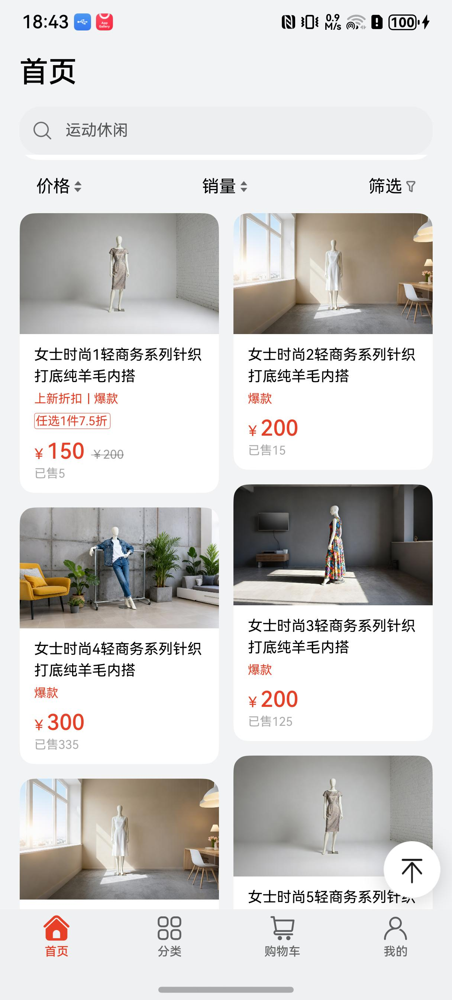 |  |

### 分类模块

|                             分类                             |                                   分类列表页面                                    |                                   商品详情页面                                    |
|:----------------------------------------------------------:|:---------------------------------------------------------------------------:|:-------------------------------------------------------------------------:|
|  |  | 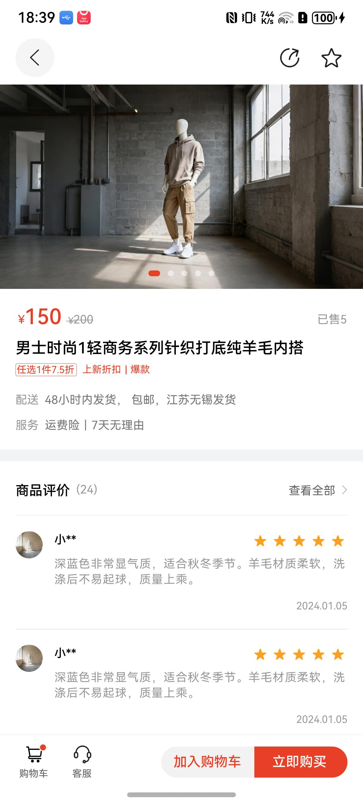 |

### 购物车模块

|                            购物车                             |                                     商品推荐                                     |                                          确定订单页面                                       |
|:----------------------------------------------------------:|:------------------------------------------------------------------------------:|:-------------------------------------------------------------------------------------:|
|  | 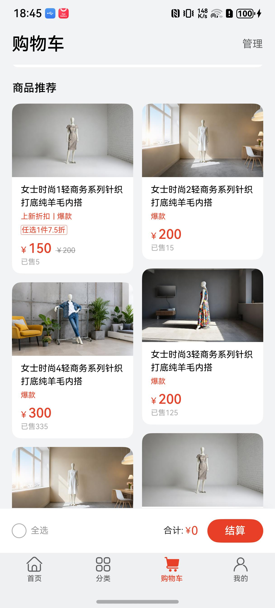 | 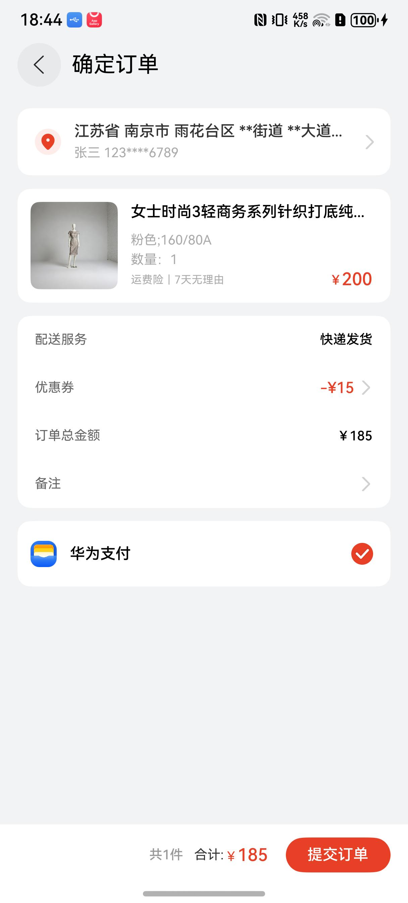 |

### 我的模块

|                          个人中心                           |                               我的订单                               |                               我的积分                               |
|:-------------------------------------------------------:|:----------------------------------------------------------------:|:----------------------------------------------------------------:|
|  | 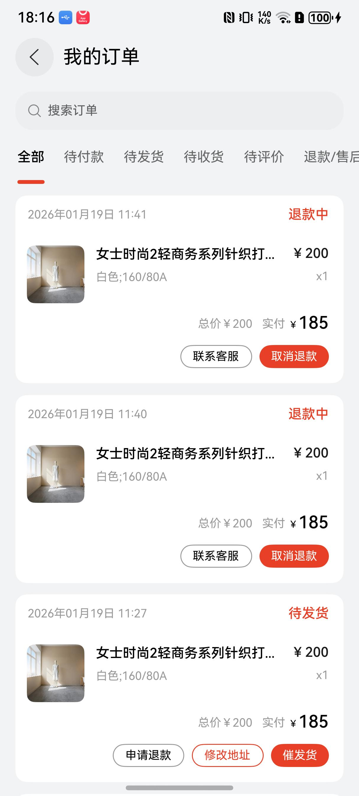 | 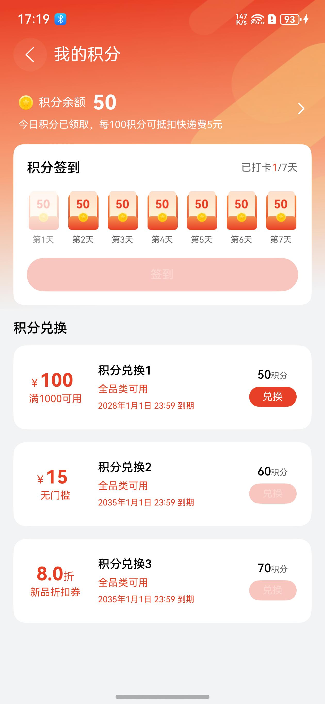 |

|                               优惠券                               |                                我的消息                                |                                设置                                |
|:---------------------------------------------------------------:|:------------------------------------------------------------------:|:----------------------------------------------------------------:|
| 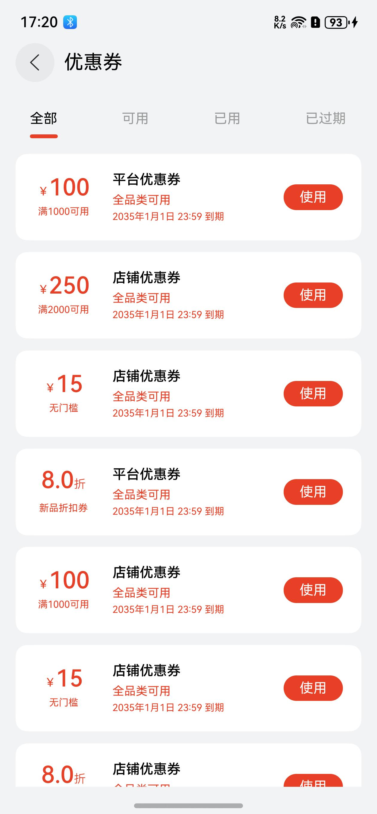 | 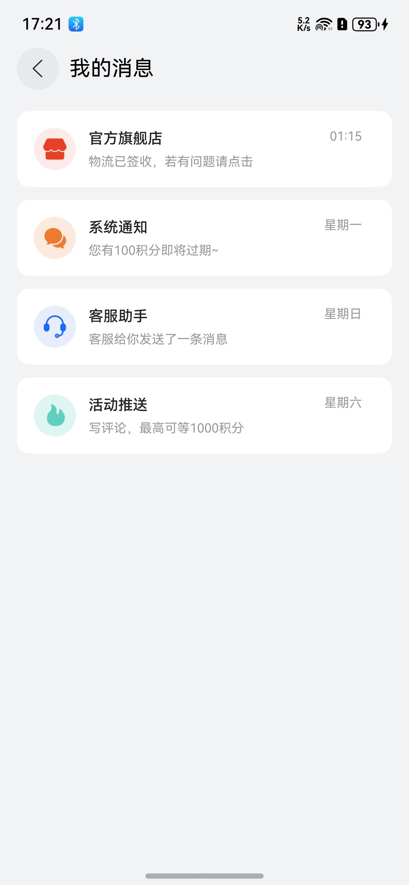 | 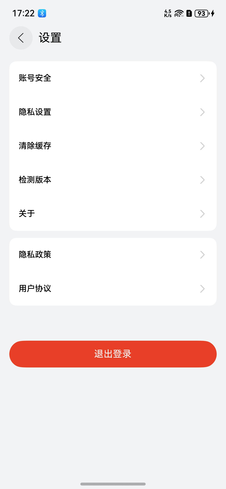 |

## 开源许可协议

该代码经过[Apache 2.0 授权许可](http://www.apache.org/licenses/LICENSE-2.0)。


